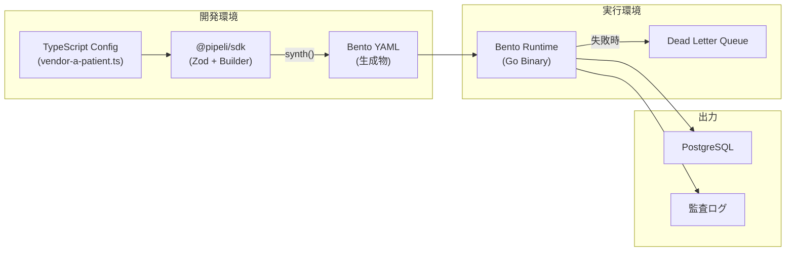

# ingestionAdapter 実装計画書（改定版）

> **Version**: 3.1  
> **作成日**: 2026-01-16  
> **ステータス**: レビュー待ち  
> **前バージョンからの主な変更**: NiFi廃止、TypeScript SDK + Drizzle ORM連携

---

## 更新履歴

| バージョン | 日付 | 変更内容 |
|-----------|------|---------|
| 1.0 | 2026-01-16 | 初版作成（NiFi + Compiler + Bento構成） |
| 2.0 | 2026-01-16 | 技術選定根拠追加、体制計画追加 |
| 3.0 | 2026-01-16 | NiFi廃止、TypeScript SDK (Code-First) アプローチへ全面移行 |
| 3.1 | 2026-01-16 | **Drizzle ORM連携**追加（Sink型安全化） |

---

## 1. 目的

多様な電子カルテ/周辺システム（ベンダー方言、統一規格なし）からのデータ連携を、**コードベース（Infrastructure as Code）で迅速・安全に実装**し、**PostgreSQLへ確実に格納**できる仕組みを提供する。

### 1.1 設計思想の転換

| 項目 | 旧計画（v2.0） | 新計画（v3.0） |
|-----|--------------|--------------|
| 設計体験 | Apache NiFi (GUI) | **TypeScript SDK (Code-First)** |
| 学習コスト | 高（NiFi固有の知識が必要） | **低（TypeScript + Zod）** |
| バリデーション | コンパイラで検証 | **Zod による型安全なバリデーション** |
| 実行 | Bento（Go）ランタイム | Bento（Go）ランタイム（変更なし） |
| 成果物形式 | NiFi JSON → IR → Bento YAML | **TypeScript → Bento YAML** |

### 1.2 成功指標（KPI）

| 指標 | 目標値 | 測定方法 |
|-----|-------|---------|
| 新ベンダー対応リードタイム | 1週間以内 | SDK定義開始〜本番稼働 |
| データ処理遅延（P99） | 500ms以下 | メッセージ受信〜DB格納 |
| 可用性 | 99.9% | 月間稼働時間 |
| 設定ミス検出率 | 100% | Zodバリデーションでの検出 |

---

## 2. スコープ

### 2.1 対象入力（段階的に拡張）

| プロトコル/形式 | Phase | SDK対応 |
|----------------|-------|--------|
| REST JSON/XML | Phase 1 | `Source.http()` |
| 固定長バイト列（Shift-JIS等） | Phase 1 | `Transform.decode()`, `Transform.fixedWidth()` |
| SFTP/SCP ファイル監視 | Phase 2 | `Source.sftp()` |
| HL7 v2 / MLLP | Phase 3 | `Source.mllp()`, `Transform.hl7()` |
| TCP生ソケット | Phase 3 | `Source.tcp()` |

### 2.2 出力

| 出力先 | SDK対応 |
|-------|--------|
| PostgreSQL (UPSERT) | `Sink.postgres()` |
| 監査ログ | `Sink.auditLog()` |

### 2.3 対象外（Out of Scope）

| 項目 | 理由 |
|-----|------|
| GUIエディタ | Code-Firstアプローチを採用（VS Codeで十分） |
| 双方向連携 | 初期スコープ外 |
| マルチテナント | 初期は単一テナント前提 |

---

## 3. 技術選定

### 3.1 アーキテクチャ概要



### 3.2 技術スタック

| コンポーネント | 技術 | バージョン | 選定理由 |
|--------------|------|----------|---------|
| **SDK** | TypeScript | 5.x | 型安全、IDE補完、チーム親和性 |
| **バリデーション** | Zod | 3.x | 実行時検証、型推論、エラーメッセージ |
| **DBスキーマ** | Drizzle ORM | 0.30.x | 型安全なDB操作、Sinkカラム検証 |
| **ランタイム** | Bento (WarpStream) | 1.3.x | 軽量、MIT、プロトコル豊富 |
| **実行環境** | Bun + Hono | 1.x | 本番バックエンドと同居 |
| **DB** | PostgreSQL | 15.x+ | UPSERT、JSONB対応 |

### 3.3 NiFi廃止の理由

| 問題点 | 影響 |
|-------|------|
| 学習コストが高い | チーム展開が困難 |
| UIが複雑（余計なパラメータ多数） | 設定ミスが発生しやすい |
| 変換レイヤー（Compiler）が必要 | 開発・保守コスト増 |
| 重いJavaアプリ | リソース消費大 |

---

## 4. SDK設計

### 4.1 基本構造

```typescript
// pipelines/src/vendor-a/patient-sync.ts
import { Pipeline, Source, Transform, Sink } from '@pipeli/sdk';

export const patientSync = new Pipeline({
  id: 'vendor-a-patient-sync',
  vendor: 'vendor_a',
  facility: 'hospital_001',
  domain: 'patient',

  input: Source.http({
    path: '/api/patients',
    methods: ['POST'],
  }),

  processors: [
    Transform.map({
      sourceId: '$.patient_id',
      familyName: '$.name.family',
      givenName: '$.name.given[0]',
    }),

    Transform.validate({
      required: ['sourceId', 'familyName'],
    }),
  ],

  output: Sink.postgres({
    table: 'patients',
    mode: 'upsert',
    idempotencyKey: ['vendor', 'facility', 'sourceId'],
  }),
});
```

### 4.2 Zodスキーマ（バリデーション）

SDK内部でZodを使用して、設定の妥当性を検証します。

```typescript
// SDK内部実装（ユーザーは意識しない）
import { z } from 'zod';

const HttpSourceSchema = z.object({
  path: z.string().startsWith('/'),
  methods: z.array(z.enum(['GET', 'POST', 'PUT', 'DELETE'])).min(1),
  timeout: z.string().optional().default('30s'),
});

const PostgresSinkSchema = z.object({
  table: z.string().min(1),
  mode: z.enum(['upsert', 'insert', 'bulk']),
  idempotencyKey: z.array(z.string()).min(1),
  connectionRef: z.string().optional(), // 環境変数参照
});

// 利用時
export function http(config: z.input<typeof HttpSourceSchema>) {
  return HttpSourceSchema.parse(config); // 自動バリデーション
}
```

### 4.3 固定長バイト列の処理

医療システムでよくある「Shift-JIS固定長データ」をサポート。

```typescript
// 使用例
const pipeline = new Pipeline({
  // ...

  processors: [
    // Shift-JIS → UTF-8 変換
    Transform.decode('Shift_JIS'),

    // 固定長フィールド切り出し
    Transform.fixedWidth({
      patientCode: [0, 8],      // 0-8文字目
      departmentCode: [8, 12],  // 8-12文字目
      visitDate: [12, 20],      // 12-20文字目
      patientName: [20, 50],    // 20-50文字目（トリム）
    }),

    // 日付フォーマット変換
    Transform.map({
      visitDate: { source: '$.visitDate', transform: 'date:YYYYMMDD->YYYY-MM-DD' },
    }),
  ],
});
```

**SDKが生成するBento YAML (Bloblang):**

```yaml
pipeline:
  processors:
    - mapping: |
        root = content().decode("shift_jis")
    - mapping: |
        root.patientCode = content().slice(0, 8).trim()
        root.departmentCode = content().slice(8, 12).trim()
        root.visitDate = content().slice(12, 20).trim()
        root.patientName = content().slice(20, 50).trim()
    - mapping: |
        root.visitDate = this.visitDate.ts_strptime("%Y%m%d").ts_format("2006-01-02")
```

### 4.4 SFTP ファイル監視

```typescript
const pipeline = new Pipeline({
  input: Source.sftp({
    address: 'sftp.hospital.local:22',
    credentialsRef: 'SFTP_CREDENTIALS', // 環境変数参照
    paths: ['/data/incoming/*.csv'],
    watcher: {
      enabled: true,
      interval: '10s',
      minimumAge: '5s', // 書き込み完了待ち
    },
  }),

  processors: [
    Transform.csv({
      delimiter: ',',
      header: true,
    }),
    // ...
  ],
});
```

### 4.5 HL7 v2 / MLLP

```typescript
const pipeline = new Pipeline({
  input: Source.mllp({
    address: '0.0.0.0:2575',
    ack: {
      mode: 'immediate',
      successCode: 'AA',
      errorCode: 'AE',
    },
  }),

  processors: [
    Transform.decode('Shift_JIS'), // 日本のHL7は大抵Shift-JIS

    Transform.hl7({
      messageType: 'ADT',
      version: '2.5',
    }),

    Transform.map({
      patientId: '$.PID.3.1',
      familyName: '$.PID.5.1',
      givenName: '$.PID.5.2',
    }),
  ],
});
```

### 4.6 Drizzle ORM連携（型安全なSink）

DBスキーマをDrizzle ORMで定義し、SDKのSinkと連携させることで、**カラム名・型の検証**をコンパイル時に行います。

#### スキーマ定義

```typescript
// db/schema.ts
import { pgTable, text, timestamp, uuid, integer } from 'drizzle-orm/pg-core';

export const patients = pgTable('patients', {
  id: uuid('id').primaryKey().defaultRandom(),
  vendor: text('vendor').notNull(),
  facility: text('facility').notNull(),
  sourceId: text('source_id').notNull(),
  familyName: text('family_name').notNull(),
  givenName: text('given_name'),
  birthDate: text('birth_date'),
  gender: text('gender'),
  createdAt: timestamp('created_at').defaultNow(),
  updatedAt: timestamp('updated_at').defaultNow(),
});

export const orders = pgTable('orders', {
  id: uuid('id').primaryKey().defaultRandom(),
  vendor: text('vendor').notNull(),
  facility: text('facility').notNull(),
  sourceId: text('source_id').notNull(),
  patientId: text('patient_id').notNull(),
  orderType: text('order_type').notNull(),
  orderStatus: text('order_status'),
  orderedAt: timestamp('ordered_at'),
  createdAt: timestamp('created_at').defaultNow(),
});
```

#### パイプライン定義での使用

```typescript
// pipelines/src/vendor-a/patient-sync.ts
import { Pipeline, Source, Transform, Sink } from '@pipeli/sdk';
import { patients } from '../../../db/schema';

export const patientSync = new Pipeline({
  id: 'vendor-a-patient-sync',
  vendor: 'vendor_a',
  facility: 'hospital_001',
  domain: 'patient',

  input: Source.http({
    path: '/api/patients',
    methods: ['POST'],
  }),

  processors: [
    Transform.map({
      sourceId: '$.patient_id',
      familyName: '$.name.family',
      givenName: '$.name.given[0]',
      birthDate: '$.birth_date',
      gender: '$.gender',
    }),
  ],

  // ✅ Drizzleスキーマを渡すことで型安全に
  output: Sink.postgres({
    schema: patients,  // ← テーブル定義を直接参照
    mode: 'upsert',
    idempotencyKey: ['vendor', 'facility', 'sourceId'],
    
    // マッピング: 補完が効く & 存在しないカラムはエラー
    mapping: {
      vendor: { literal: 'vendor_a' },
      facility: { literal: 'hospital_001' },
      sourceId: '$.sourceId',
      familyName: '$.familyName',
      givenName: '$.givenName',
      birthDate: '$.birthDate',
      gender: '$.gender',
      // naem: '...'  ← TypeScriptエラー: 'naem' は存在しない
    },
  }),
});
```

#### 型チェックの動作

```typescript
// ❌ エラー例1: 存在しないカラム
mapping: {
  patientName: '$.name',  // Error: 'patientName' は patients に存在しません
}

// ❌ エラー例2: 必須カラムの欠落
mapping: {
  sourceId: '$.id',
  // Error: 必須カラム 'familyName' が指定されていません
}

// ✅ 正しい定義: 補完で候補が出る
mapping: {
  sourceId: '$.id',
  familyName: '$.name.family',  // Ctrl+Space で候補表示
}
```

#### SDK内部実装（型定義）

```typescript
// SDK内部: Drizzle連携型
import { PgTable, PgColumn } from 'drizzle-orm/pg-core';

type InferTableColumns<T extends PgTable> = {
  [K in keyof T['_']['columns']]: string | { literal: string };
};

interface PostgresSinkConfig<T extends PgTable> {
  schema: T;
  mode: 'upsert' | 'insert' | 'bulk';
  idempotencyKey: (keyof T['_']['columns'])[];
  mapping: Partial<InferTableColumns<T>>;
  connectionRef?: string;
}

export function postgres<T extends PgTable>(config: PostgresSinkConfig<T>) {
  // Zodでランタイムバリデーションも実行
  return new PostgresSink(config);
}
```

---

## 5. ビルドと実行

### 5.1 ディレクトリ構成

```
ingestion-adapter/
├── sdk/                          # @pipeli/sdk パッケージ
│   ├── src/
│   │   ├── pipeline.ts
│   │   ├── source/
│   │   │   ├── http.ts
│   │   │   ├── sftp.ts
│   │   │   └── mllp.ts
│   │   ├── transform/
│   │   │   ├── decode.ts
│   │   │   ├── fixed-width.ts
│   │   │   ├── csv.ts
│   │   │   └── hl7.ts
│   │   └── sink/
│   │       └── postgres.ts
│   ├── package.json
│   └── tsconfig.json
│
├── db/                           # Drizzle ORM スキーマ定義
│   ├── schema.ts                 # テーブル定義
│   ├── migrations/               # マイグレーションファイル
│   └── drizzle.config.ts
│
├── pipelines/                    # パイプライン定義（ベンダー別）
│   ├── src/
│   │   ├── vendor-a/
│   │   │   ├── patient-sync.ts
│   │   │   └── order-sync.ts
│   │   └── vendor-b/
│   │       └── result-sync.ts
│   ├── dist/                     # 生成されたBento YAML
│   │   ├── vendor-a-patient-sync.yaml
│   │   └── ...
│   └── package.json
│
├── bento/                        # Bentoバイナリ・設定
│   └── bin/
│       └── bento                 # Go実行ファイル
│
└── docs/
    └── sdk-reference.md
```

### 5.2 ビルドコマンド

```bash
# パイプライン定義をビルド（YAML生成）
cd pipelines
npx ts-node src/vendor-a/patient-sync.ts

# または一括ビルド
npm run build
```

**`package.json` スクリプト例:**

```json
{
  "scripts": {
    "build": "ts-node scripts/build-all.ts",
    "validate": "ts-node scripts/validate-all.ts",
    "lint": "bento lint dist/*.yaml"
  }
}
```

### 5.3 実行（本番デプロイ）

本番では Bun + Hono バックエンドと Bento を同一コンテナに同居させます。

```dockerfile
# Dockerfile
FROM oven/bun:1.0

# Bentoバイナリをコピー
COPY --from=ghcr.io/warpstreamlabs/bento:latest /bento /usr/local/bin/bento

# アプリケーションコード
WORKDIR /app
COPY . .

# 起動スクリプト
CMD ["./start.sh"]
```

```bash
#!/bin/bash
# start.sh

# Bento をバックグラウンドで起動
bento -c /app/pipelines/dist/vendor-a-patient-sync.yaml &

# Bun + Hono を起動
bun run src/index.ts
```

---

## 6. 設計方針（維持事項）

以下は旧計画から引き続き採用します。

### 6.1 Canonical Model（正規化イベント）

| イベント | 用途 |
|---------|------|
| `PatientUpsert` | 患者マスタ更新 |
| `EncounterUpsert` | 来院/入院情報更新 |
| `OrderUpsert` | オーダー更新 |
| `ResultFinalized` | 検査結果確定 |
| `DocumentStored` | 文書保存 |

### 6.2 冪等性

```typescript
output: Sink.postgres({
  table: 'patients',
  mode: 'upsert',
  idempotencyKey: ['vendor', 'facility', 'sourceId'],
  // → UPSERT時に ON CONFLICT (vendor, facility, source_id) DO UPDATE
}),
```

### 6.3 監査ログ

```typescript
output: Sink.postgres({
  // ...
  audit: {
    enabled: true,
    storeRaw: true,
    hashAlgorithm: 'sha256',
  },
}),
```

### 6.4 Secrets分離

設定ファイルに秘密情報を直書きしない。環境変数参照を使用。

```typescript
input: Source.sftp({
  credentialsRef: 'SFTP_PRIVATE_KEY', // 環境変数名
}),

output: Sink.postgres({
  connectionRef: 'DATABASE_URL', // 環境変数名
}),
```

SDKがZodでバリデーション時に「ハードコードされた秘密情報」を検出した場合はエラーにします。

### 6.5 DLQ運用

```typescript
const pipeline = new Pipeline({
  // ...

  errorHandling: {
    retry: {
      maxAttempts: 3,
      backoff: { initial: '1s', max: '30s' },
    },
    dlq: {
      enabled: true,
      table: 'dead_letter_queue',
    },
  },
});
```

---

## 7. 実装タスク（フェーズ計画）

### Phase 0: 準備（1週間）

- [ ] リポジトリ構成確定
- [ ] SDKプロジェクト雛形作成
- [ ] Zodスキーマ設計（基本型）
- [ ] **Drizzle ORM セットアップ**
- [ ] CI/CD設定（lint, test, build）

**成果物:**
- `sdk/` パッケージ雛形
- Zodスキーマ（Source, Transform, Sink基本型）
- `db/schema.ts`（基本テーブル定義）

---

### Phase 1: SDK Core（2週間）

- [ ] `Pipeline` クラス実装
- [ ] `Source.http()` 実装
- [ ] `Transform.map()`, `Transform.validate()` 実装
- [ ] `Sink.postgres()` 実装
- [ ] YAML生成（synth）実装
- [ ] **最小E2E検証**（HTTP → Postgres）

**成果物:**
- `@pipeli/sdk` v0.1.0
- 動作するサンプルパイプライン1本

---

### Phase 2: 入力拡張（2週間）

- [ ] `Transform.decode()` （文字コード変換）
- [ ] `Transform.fixedWidth()` （固定長切り出し）
- [ ] `Transform.csv()` （CSVパース）
- [ ] `Source.sftp()` （SFTP監視）

**成果物:**
- SDK v0.2.0
- 固定長データ処理サンプル
- SFTPファイル取り込みサンプル

---

### Phase 3: 医療特化（3週間）

- [ ] `Source.mllp()` （HL7 v2 受信）
- [ ] `Transform.hl7()` （HL7パース）
- [ ] ACK/NACK処理
- [ ] ベンダー別マッピングテンプレート

**成果物:**
- SDK v0.3.0
- HL7 v2 ADTサンプル

---

### Phase 4: 運用整備（2週間）

- [ ] DLQ CLI（list/show/replay/discard）
- [ ] 監査ログ出力仕様
- [ ] Grafanaダッシュボードテンプレート
- [ ] 運用Runbook

**成果物:**
- DLQ CLI
- 監視ダッシュボード
- 運用ドキュメント

---

## 8. 受け入れ基準

### 機能要件

| 項目 | 基準 |
|-----|------|
| SDK定義 | TypeScriptで書いたパイプライン定義がBento YAMLに変換される |
| バリデーション | Zodで設定ミスを検出し、分かりやすいエラーメッセージを出力 |
| データ格納 | 正規化イベントがPostgresへUPSERT |
| 冪等性 | 再実行しても二重登録しない |
| DLQ | 故障時にDLQへ入り、replayで復旧可能 |

### 運用要件

| 項目 | 基準 |
|-----|------|
| デプロイ | Bun + Bentoが同一コンテナで動作 |
| Secrets | 設定ファイルに秘密情報を含まない（環境変数参照のみ） |
| 監視 | ヘルス、ログ、メトリクスが揃う |

---

## 9. リスクと対策

| リスク | 発生確率 | 影響 | 対策 |
|-------|---------|------|------|
| SDK開発工数が想定超過 | 中 | 中 | Phase 1で最小機能に絞り、早期にE2E検証 |
| Bento機能がSDKでカバーしきれない | 低 | 中 | カスタムBloblang記述を許可する `Transform.raw()` を用意 |
| Zodスキーマが複雑化 | 中 | 低 | 階層を浅く保ち、エラーメッセージをカスタマイズ |
| チームのTypeScript習熟度 | 低 | 低 | サンプルとドキュメントを充実させる |

---

## 10. 直近の実装着手順（最短ルート）

### Step 1: SDK雛形 + Zodスキーマ（3日）

```bash
mkdir sdk && cd sdk
npm init -y
npm install typescript zod
```

基本的な `Pipeline`, `Source.http()`, `Sink.postgres()` の型とZodスキーマを定義。

### Step 2: YAML生成（synth）実装（3日）

TypeScriptオブジェクト → Bento YAML 文字列への変換ロジックを実装。

### Step 3: 最小E2E検証（2日）

1. SDKでパイプラインを定義
2. YAML生成
3. Bentoで実行
4. curlでPOST → PostgreSQLに格納を確認

**この時点で技術的実現性を確認**

### Step 4: 機能拡張（Phase 2-3）

固定長、SFTP、HL7を順次追加。

---

## 付録

### A. 用語集

| 用語 | 説明 |
|-----|------|
| SDK | Software Development Kit。パイプライン定義用TypeScriptライブラリ |
| Bento | Go製ストリームプロセッサ（WarpStream） |
| Bloblang | Bentoのマッピング言語 |
| Zod | TypeScript用スキーマバリデーションライブラリ |
| DLQ | Dead Letter Queue（失敗メッセージ隔離先） |
| MLLP | Minimal Lower Layer Protocol（HL7用TCP） |

### B. 参考リンク

| リソース | URL |
|---------|-----|
| Bento (WarpStream) | https://warpstreamlabs.github.io/bento/ |
| Bento Bloblang | https://warpstreamlabs.github.io/bento/docs/guides/bloblang/about |
| Zod | https://zod.dev/ |
| TypeScript | https://www.typescriptlang.org/ |

### C. 決定ログ

| 日付 | 決定事項 | 理由 |
|-----|---------|------|
| 2026-01-16 | Apache NiFi を廃止 | 学習コスト高、チーム展開困難 |
| 2026-01-16 | TypeScript SDK (Code-First) を採用 | 型安全、IDE補完、Zodによるバリデーション |
| 2026-01-16 | Bento ランタイムは維持 | 機能的に十分、軽量、MIT |
| 2026-01-16 | **Drizzle ORM を採用** | Sinkの型安全化、カラム名・型チェック |
